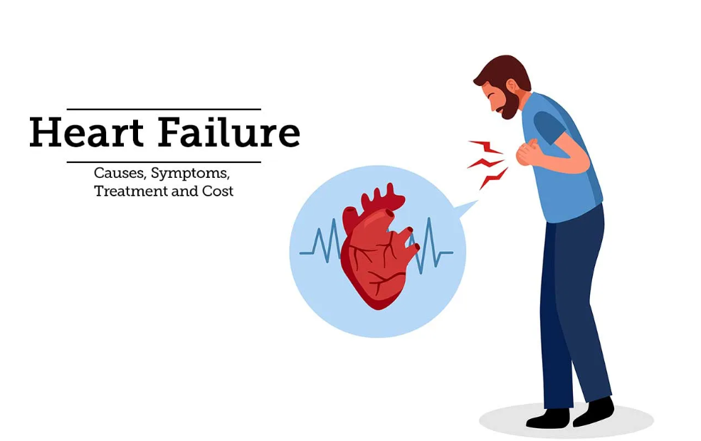

## HEART-FAILURE-PREDICTION

### Software and Tools Requirements

1. [Github Account](https://github.com)
2. [HerokuAccount](https://heroku.com)
3. [VSCodeIDE](https://code.visualstudio.com/)
4. [GitCLI](https://git-scm.com/book/en/v2/Getting-Started-The-Command-Line)

Create a new environment

```
python -m venv venv
```

<h1 align="center">Heart Failure Prediction using Data Science</h1>

<p align="center">
  
</p>

## :clipboard: Project Overview

The goal of this project is to develop a data science model that accurately predicts the likelihood of heart failure in patients based on clinical and demographic features. Early detection and prediction of heart failure can significantly impact patient outcomes. This project utilizes machine learning techniques and a comprehensive dataset to create a predictive model that helps healthcare professionals identify individuals at higher risk of heart failure.

##  :rocket: Technologies Used

- Jupyter Notebook
- Flask
- Python

##  :chart_with_upwards_trend: Project Steps

1. **Data Collection**: Gather a comprehensive dataset containing patient clinical and demographic information.

2. **Data Preprocessing**: Clean the dataset, handle missing values, outliers, and perform necessary transformations. Explore data using visualization techniques.

3. **Model Training**: Select and train machine learning algorithms using the prepared dataset.

4. **Model Evaluation**: Assess the model's performance using appropriate metrics and techniques.

5. **Model Deployment**: Create an API using Flask to deploy the trained model and provide predictions based on user input.

6. **Continuous Monitoring and Updates**: Monitor the model's performance, gather feedback, and make updates to improve accuracy.


## :bar_chart: Results and Impact

The successful completion of this project provides healthcare professionals with a tool for predicting heart failure. Early detection and intervention can improve patient outcomes. The developed model and API assist in identifying individuals at risk of heart failure, enabling timely interventions and appropriate care.

## :busts_in_silhouette: Contributors

- [khaled Ben Abderrahim](https://github.com/KhaledBenAbderrahim)

##  :scroll: License

This project is licensed under the [MIT License](LICENSE).


